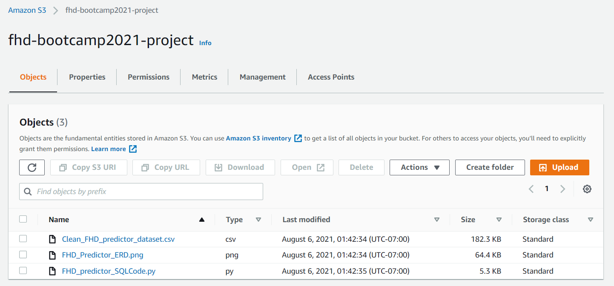

# __BootCamp_Project__

## __Overview:__
Originially - The group identified YouTube videos with 6000 records to performn the analysis and use machine learning to understand which feature contributes the most to make the video trending. Using the regression model, the accuracy score was less tha 0.80, hence, the group switched the project to a different dataset (Heart Disease).

In this current dataset which is related to Heart Disease, our  objective is to identify the the weightage for each feature i.e. preexisting condition, medication, age group and other parameters to predict whether a patient is at hear disease risk or not.  

### __Dataset selection:__
A number of datasets were reviewed before finalizing the Youtube Video Dataset from source - Kaggle.com, namely:
- Youtube trending Video 
- Dataset to predict preferences to opt for Travel insurance
- Reading Habits prediction in US adults
- Walmart sales Retail data set
- House Sale Price prediction
- Fuel vs Electric vehicle preference prediction
- Heart Disease

A decision was made to analyze the dataset for Heart Disease for female patients only.

### __Reason for selection__

A) General Reasons
1. A relevant topic that is relatable to a wide audience.
2. Beneficial to a number of stakeholders such as Patients at risk, hospitals and health systems, insurance companies
3. A robust automated system to predict heart Disease may enable an increased accuracy of diagnosis.
4. It could enable Health Systems to provide better quality of care.
5. It will especially be beneficial in taking timely preventive action especially in female patients as they present atypical symptoms when compared to males leading to difficulties and delays in diagnosis.

B) Project specific reasons
1. Availability of the dataset
2. Availability of number of records for the data required to perform the analysis.
3. Applicability of tools and technologies learnt during the course to meet the deliverables.

## Description of source of the data
This dataset is available on Kaggle where the publisher has extracted it from UCI (https://archive.ics.uci.edu/ml/machine-learning-databases/heart-disease/). It contains details such as patient age, medication, test results,smoking pattern to predict whether the patient is at risk or not.
Source: https://www.kaggle.com/dileep070/heart-disease-prediction-using-logistic-regression

### __Purpose of Analysis:__
For the purpose of our analysis, we will use data related to heart disease to predict whether the patient has geat disease risk or not.

The following actions will be performed:

- Perform analysis for current BP and cholestrol level, current smoking pattern,age group, any current BP medication, glucose level.
- Use Machine learning models to predict the patients risk for heart disease

## __Team and Roles:__
- Square - Neeraja Jayaraman
- Triangle -  Dixie Peralta, Richelle Long
- Circle - Nisha Bharakhada
- X - Dixie Peralta, Richelle Long, Neeraja Jayaraman & Nisha Bharakhada

## __Commmunication protocol:__
The following modes of communication will be used by the team.
1. Git Hub - Coding, ReadMe, Commits and Final Project Results  
2. Slack - Team's main communication  
3. Google Drive  - For Assignments, Documents and Notes  
4. Zoom - Daily / Weekly meetups
For more details, please refer to the communication protocol document.
[CommunicationProtocol.docx](CommunicationProtocol.docx)

## __Presentation:__
- Provisional Machine learning Model - Neeraja and Nisha
- Provisional Database - Dixie & Richelle
Presentation can be viewed at this link:
https://drive.google.com/file/d/1jBHAhm4AzAVBi5AUHJoCA3l3yXS9wJuA/view?usp=sharing

The presentation can be viewed at the following link: 
Segment 1 - https://drive.google.com/file/d/1jBHAhm4AzAVBi5AUHJoCA3l3yXS9wJuA/view?usp=sharing
Segment 2 - https://drive.google.com/drive/folders/14KQiHRpSGZYOli-9ZkKgPc7hI9MZ7THd

- Flow Diagram

## __Tools and technologies used in Segment 1:__

- Microsoft Excel - To view the data once csv file is downloaded
- Postgress SQL - To create a database
- Python (Jupyter Notebook)
- QBD - To create ERD diagram
- Github
- Google Drive - To keep all the documents at one central location
For more details, please refer to the Technology documentation.

## __Machine Learning Model Description:__

The machine learning model proposed for this project is Multiple regression model in order to predict the trisk of patient for heart disease. 

For more details, please refer to the Machine Learning Documentation.

## __Database Description:__

For details on Data ETL process and database setup, please refer to the Database documentation.

The schema of the database can be viewed below:
Quick Database Diagram:

It has been proposed that our database will be created in 
PostgreSQL – Relational Database System, as seen in the screenshot below:

- Connection String (AWS to PostgressSQL)

- File on AWS - S3 bucket

## Dashboard Visualization:
For Dashboard blueprint, please refer to the below files:

1) Risk by BP and  Agegroup 

2) Risk by Agegroup 

3) Risk by Cholestrollevel

4) Risk by SmokingPattern.PNG

