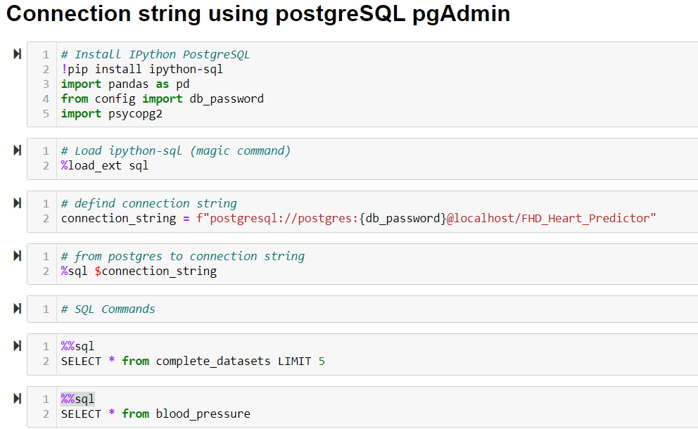

# __BootCamp_Project__

## __Overview:__
This project deals with Heart Disease Risk data analysis based on the Framingham study that comprises of 4238 records containing heart related health parameters and demographics of a set of patients.

With this current dataset which is related to Heart Disease, our  objective is to identify whether a patient is at risk for heart disease or not, based on features such as  preexisting conditions, medication, age group and other parameters.

### __Dataset selection:__
A number of datasets were reviewed before finalizing the Heart Disease Dataset from source - Kaggle.com. Additional secondary datasets were extracted from CDC, American Heart Association and Mayo Clinic.

The dataset comprises of demographic details, habits, existing health conditions and parameters for each patient record, along with their heart disease risk. This project analyzes the risk of Heart Disease for female patients only.

### __Reason for selection:__
Heart Disease is one of the leading cause of death for men and women in the United States. It is said that women are at a greater risk for Heart Disease than men. About 1 in every 5 female deaths is due to heart disease(www.cdc.gov)

A) General Reasons for selection
1. A relevant topic that is relatable to a wide audience.
2. Beneficial to a number of stakeholders such as Patients at risk, hospitals and health systems, insurance companies
3. A robust automated system to predict heart Disease may enable an increased accuracy of diagnosis.
4. It could enable Health Systems to provide better quality of care.
5. It will especially be beneficial in taking timely preventive action especially in female patients as they present atypical symptoms when compared to males leading to difficulties and delays in diagnosis.

B) Project specific reasons
1. Availability of the dataset
2. Availability of number of records for the data required to perform the analysis.
3. Applicability of tools and technologies learnt during the course to meet the deliverables.

### __Description of source of the data:__
This dataset has been sourced from Kaggle. 

- Primary Data Source: https://www.kaggle.com/dileep070/heart-disease-prediction-using-logistic-regression
This contains details such as patient age, medication, test results,smoking pattern to predict whether the patient is at risk or not.

- Secondary Data Source: This includes the data required for Analysis and Vizualisation

- Glucose Levels: https://www.cdc.gov/diabetes/basics/getting-tested.html
- Blood Pressure: https://www.heart.org/en/health-topics/high-blood-pressure/understanding-blood-pressure-readings
- BMI details:  https://www.cdc.gov/healthyweight/assessing/bmi/adult_bmi/index.html

## __Purpose of Analysis:__
Through this analysis, the following questions will be answered:
1. What is the relationship between pre-existing conditions and risk for heart disease?
2. What conditions have a greater impact on heart health over others?
3. How does the existemce of multiple conditions impact heart disease?
4. Is it possible to predict a person's risk for heart disease based on studying the patterns of features such as demographics, preexisting conditions,habits and parameters?

The following actions will be performed:
- Perform analysis for current BP and cholestrol level, current smoking pattern,age group, any current BP medication, glucose level.
- Use Machine learning models to predict the patients risk for heart disease

## __Team and Roles:__

- Dixie Peralta -  Github Repository, Database, ETL and Dashboard
- Richelle Long - Dashboard, Database, ETL and Presentation
- Nisha Bharakada - GitHub ReadMe, Presentation/ Google Slides, Dashboard, Machine Learning Model.
- Neeraja Jayaraman -  Project Planning, GitHub ReadMe, Exploratory Data Analysis and Machine Learning Model.

## __Tools and technologies:__

- Microsoft Excel - To view the data once csv file is downloaded
- Postgress SQL - To create a database
- Python (Jupyter Notebook)
- QDB - To create ERD diagram
- SCIKIT learn machine learning Library 
- Tableau for Visualizations
- Github
- Google Drive - To keep all the documents at one central location

For more details, please refer to the Technology documentation.

## __Presentation:__

The presentation for this project can be viewed at the following link: 

## __Database Description:__

The following flow diagram describes the data Extract, Transform and Load process:

For details on the data ETL process and database setup, please refer to the Database documentation.

The code for ETL can be viewed here: [predicting_heart_disease_in_females.ipynb](/JupyterNotebook_DatasetandMLM/predicting_heart_disease_in_females.ipynb)

The following is the connection string for the data loaded into PostgreSQL:

The schema of the database can be viewed in the
Quick Database Diagram below:

The database has been created in PostgreSQL – Relational Database System, as seen in the screenshot below:

Different tables were joined using 'join' query and an extract of the data was provided for the Machine learning Model:

## __Exporatory Data Analysis and Machine Learning Model:__

The machine learning model proposed for this project is a Binary Classification Model in order to predict the risk of female patients for heart disease based on existing features and parameters. Classification models such as Logistic regression, Support vector Model, Random Forest Classifier, Decision Tree Classifier and Gradient Boosting Model have been used. Each model’s accuracy score and Classification report have been recorded.
For more details, please refer to the Machine Learning Documentation.

The code for Exploratory Data Analysis and Machine Learning Model can be viewed here:
[FINALHeartDiseasePredictor_MLM.ipynb](/JupyterNotebook_Dataset_and_MLM/FINALHeartDiseasePredictor_MLM.ipynb)

## __Dashboard Visualization:__

Tableau Public has been used to create visualizations for this project. For the purpose of data analysis and making decisions related to the Machine learning prediction model, visualizations ahve been created on tableau.

For Dashboard, please refer to the below link:
https://public.tableau.com/authoring/FemaleHeartDiseasePredictor/Story_Board#1

## __Results of Analysis:__

The dashboard above displays the relationship between various preexisting conditions and heart disease.

As per data analysis performed and different Machine Learning models attempted, it has been identified that the best accuracy score was achieved by using Logistic Regression Model. However, considering the dataset is relevant to heart disease, better precision and recall score along with accuracy score is imperative, hence it was concluded that Decision Tree Model to be more relevant model for this dataset to predict whether the patient has risk for coronary heart disease in the  next 10 years. 

## __Recommendations for Future Analysis:__

- Hosting the database on the cloud such as on AWS platform would make it more accesible.
- The dataset was discovered to have high class imbalances in the Target Value - Ten Year Heart Disease prediction. As a result it yielded low precision and recall scores for prediction of existence of Heart disease versus non existence of heart disease.
- Adding more features and dimensions as well as increasing the size of datasets by adding more recent data, could help in attaining better precision, recall and accuracy scores.
- Other Machine learning models such as simple Neural networks could be attempted for a  more optimal result.

## __Project Learnings and Challenges__

- Understanding dataset is imperative before performing data cleaning or  data analysis.
- Knowledge of Domain/Subject Matter helps to understand the significance and weightage for each value present in the dataset.
- From the dataset, it is important to analyze whether the dataset alone will suffice the requirement to achieve the target or objective to resolve any problem/ question we are hoping to answer. 
- Selection of dataset is a key to address the issue/problem in terms of feature available, datatype, validity and authenticity of the datasource. 
- In case the data is incomplete, it has risk of inaccurate analysis and incorrect prediction based on the machine learning model selected.

## __Closing Observations:__

In conclusion, a robust machine learning model, when presented with a good quality dataset can be a very useful tool in predicting heart disease risk ion patients. 
